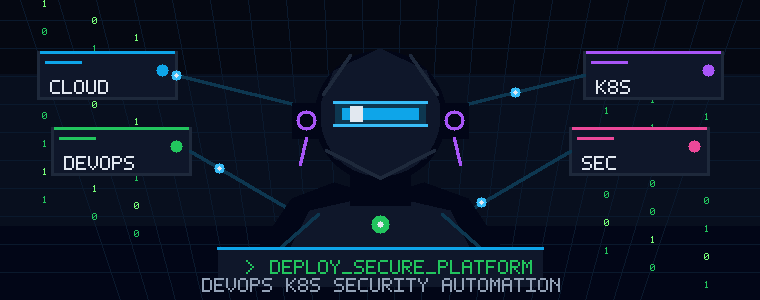
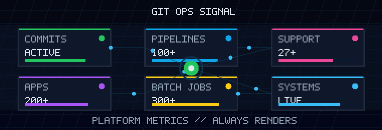

<div align="center">

### Architecting Resilience. Engineering Automation. Delivering at Scale.
### Striving to make an impact!
### The Code Ships Itself — I Just Design & Build the Track

  <a href="mailto:shahzaneer.dev@gmail.com"></a>
  <a href="https://linkedin.com/in/shahzaneer"></a>
  <a href="https://github.com/shahzaneer"></a>
  <a href="https://leetcode.com/shahzaneer"></a>
  <a href="https://instagram.com/shahzaneer"></a>
  <a href="https://medium.com/@shahzaneer"></a>
  <a href="https://twitter.com/shahzaneerdev"></a>

  <br />
  <br />

  

  <br />
  <br />

  

</div>

---

## `$ cat about_me.yaml`

```yaml
name: Shahzaneer Ahmed
role: Cloud DevOps Engineer | Solution Architect
current_company: Alethia AI
education: B.S. Computer Science @ COMSATS University Islamabad
experience: 3+ years

specializations:
  - OnPrem & Cloud Infrastructure
  - Kubernetes, Docker & OpenShift
  - CI/CD Pipelines, GitOps & MLOps
  - DevSecOps & SRE
  - Observability & Platform Engineering
  - Cloud Solution Architecture
  - AI/ML and GPU Infrastructure

goal_2026: >
  Become a better platform and stack agnostic
  Cloud Solution Architect

interests:
  - Content Creation
  - Cricket: left-arm wrist spin + left-hand batter
  - Community Building

contact: shahzaneer.dev@gmail.com
whatsapp: +923164606490
```

I engineer the systems behind the systems: cloud platforms, automated delivery paths, secure runtime foundations, and production infrastructure for AI, blockchain, and fintech-grade workloads.

I like infrastructure that is boring in the best way: repeatable, observable, recoverable, secure, and designed before it is scaled.

---

## `$ cat current_work.log`

Currently working as a **Cloud & AI Infrastructure Engineer** at Alethia AI, designing and operating scalable AI/ML and GPU-based workloads across **AWS**, **GCP**, **RunPod**, and **Vast.ai**.
Alethia AI is a Singapore-based AI R&D Lab building Generative AI, blockchain, digital-twin, and real-time agentic AI technologies for Education, financials and creative world.

My work sits at the intersection of cloud platforms, DevOps automation, security, AI compute, and blockchain infrastructure.

<div align="center">



</div>

---

## `$ ls -la ./tech-stack/`

<div align="center">

### ☁️ Cloud Platforms


### 🐳 Containers & Orchestration


### 🔁 CI/CD, GitOps & MLOps


### 🏗️ IaC & Automation


### 📊 Observability & Monitoring


### 🔐 Security


### 💻 Languages, Backend & Databases


</div>

---

## `$ cat experience.log`

<details>
<summary><b>🧠 Alethia AI · Cloud & AI Infrastructure Engineer · Singapore (Remote)</b></summary>

<br>

> AI R&D lab building generative AI, blockchain, digital-twin, and real-time agentic technologies

- Architect secure, scalable multi-cloud infrastructure across **AWS, GCP, RunPod & Vast.ai** for AI/ML, GPU-intensive, and blockchain workloads
- Operate **Kubernetes & Amazon EKS** platforms and automate infrastructure and delivery using **Terraform, GitHub Actions, Jenkins, Python & Bash**
- Conduct **AWS security audits** across IAM, networking, encryption, storage, secrets, logging, and configuration risks
- Embed **shift-left security** with SAST, SCA, dependency and container scanning, and security quality gates
- Improve **CI/CD build and deployment times**, strengthen observability with **Prometheus, Grafana & Loki**, and drive **FinOps** through rightsizing, workload scheduling, and cloud/GPU cost optimization

</details>

<details>
<summary><b>🏢 i2c Inc. · Cloud DevOps / Platform Engineering · California, US</b></summary>

<br>

**`Cloud DevOps Engineer (Automation)` — Jan 2026 – April 2026**
> Promoted to senior DevOps responsibilities within the Core Platform Team

- ⚡ Improved and optimized existing CI/CD pipelines for **efficiency, reliability, and scalability**
- 🐍 Automated and maintained **client onboarding scripts** using Shell & Python, reducing manual effort
- 🔴 Deployed applications on **OpenShift** leveraging container orchestration for production workloads
- 🔧 Developed **Ansible automation scripts** for infrastructure provisioning and deployment
- 🔐 Implemented **DevSecOps practices** including TLS certificate management with **Vault & ESO**
- 📊 Built **ELK logging stack from scratch**, ensuring centralized observability across environments
- 🏆 Took ownership of the **enterprise DevOps ecosystem**, driving automation, security & operational excellence

<br>

**`Associate Cloud DevOps Engineer (Automation)` — Jun 2025 – Jan 2026**
> Promoted to the Core DevOps/Platform Team of i2c Inc.

- 🛡️ Provided **L3/L4 DevOps Support** by architecting and automating infrastructure components
- ☸️ Built and managed **Kubernetes clusters** to support scalable containerized workloads
- 🔄 Implemented **GitOps workflows using ArgoCD** for secure, automated, declarative deployments
- 🏗️ Designed and maintained **100+ CI/CD pipelines**, streamlining code integration, delivery & regression testing
- ✅ Integrated **SonarQube** for code quality checks and automated feedback loops
- 📦 Managed artifacts using **Nexus**, automated IaC using **Helm & Kustomize**
- 📈 Integrated **Prometheus & Grafana** for real-time monitoring, observability, and alerting
- 🐳 Optimized **Dockerized environments** for performance, consistency & reproducibility

<br>

**`Associate Cloud DevOps Engineer (SRE & Release)` — Feb 2025 – Jun 2025**
> Started at the SRE & Release team, supporting enterprise-scale production systems

- 🌐 Supported production-grade systems across **Dev, QA, UAT, Staging, Perf & Production** environments
- 🚨 Delivered **L1/L2 incident response** for **27+ scrum teams** with triage, escalation & resolution
- 📡 Monitored and managed **300+ batch processes, 200+ applications & 100+ web services**
- 🔍 Performed **Root Cause Analysis (RCA)** for critical incidents to minimize downtime
- 🐧 Hands-on with **Red Hat Enterprise Linux (RHEL)** for operations, troubleshooting & production support
- 🤖 Automated recurring tasks using **Shell scripting** to reduce manual effort
- 📋 Managed release versions with **Git & SVN** across on-prem environments
- 🔭 Utilized **Nagios, Xymon & Dynatrace** for proactive alerting, detection & issue resolution

</details>

<details>
<summary><b>🎓 Buildables · Cloud & DevOps Fellowship Instructor · Aug–Nov 2025 · Remote, Pakistan</b></summary>

<br>

- Trained and mentored **10 fellows** for entry-level Cloud/DevOps roles
- Covered DevOps fundamentals and multi-cloud foundations across **AWS (CCP), GCP (ACE) & Azure (AZ-900)**
- Focused on cloud security basics, cost awareness, real-world deployment & interview readiness

</details>

<details>
<summary><b>🦅 DevHawks · Backend & MLOps Engineer · Sep 2023 – Nov 2024 · Remote, Pakistan</b></summary>

<br>

- Built **RESTful APIs** with FastAPI & Go, improving response times by **30%**
- Integrated **WebSockets** for real-time features, reducing latency by **25%**
- Containerized apps with **Docker**, boosting deployment efficiency by **40%**
- Automated **CI/CD with GitHub Actions**, cutting deployment time by **50%**
- Optimized APIs, reducing server load by **35%** and enhancing scalability

</details>

<details>
<summary><b>📱 Bytewise Limited · Flutter Fellowship Instructor · Jun–Sep 2024 · Remote, Pakistan</b></summary>

<br>

- Trained **20+ fellows** in Flutter, Firebase, app architecture & mobile app development
- Developed and delivered a comprehensive training program from beginner to advanced levels
- Provided project guidance for **5+ projects** and led the fellowship program end-to-end

</details>

<details>
<summary><b>💼 Arbisoft · Software Engineer Intern · Jul–Sep 2023 · Lahore, Pakistan</b></summary>

<br>

- Selected after a rigorous interview and shortlisting process at one of Pakistan's leading software houses
- Learned best practices in **clean coding, design patterns & mobile app development**
- Received guidance from experienced software professionals at Arbisoft

</details>

---

## `$ cat community.log`

<details>
<summary><b>🔒 Cloud Native Security Lahore (CNCF) · Core Team Member · Jul–Nov 2025</b></summary>

<br>

- Part of the core team for CNS Lahore, an **official CNCF community**
- Managed outreach for **CNCF's 10th Anniversary** celebrations in Lahore, Pakistan
- Engaged with Cloud, DevSecOps, Kubernetes & Security professionals to build community presence

</details>

<details>
<summary><b>🎤 TEDxCOMSATS Islamabad · Founder & 2X Organizer · Dec 2022 – Jan 2025</b></summary>

<br>

- **Founded** TEDxCUI by securing the official TED license and organizing the inaugural event
- Curated **20+ speakers** across themes including *Reviving the Thought Process* and *The Journey Within*
- Returned as **Team Mentor** for TEDxCUI's second edition

</details>

<details>
<summary><b>👨‍💻 Google Developer Student Clubs CUI · Campus Lead · Aug 2023 – Aug 2024</b></summary>

<br>

- Reinvigorated GDSC CUI from the ground up as **Campus Lead**
- Built **10+ teams** across programming, web, mobile, and AI/ML
- Organized **30+ events**, including 8 physical events
- Led GDSC CUI to become the **best computing club** at COMSATS University Islamabad
- Continued as **Team Mentor**

</details>

<details>
<summary><b>☁️ AWS Learning Club CUI · Founding Mentor · Sep 2024 – Jan 2025</b></summary>

<br>

- Contributed to establishing the **first AWS Cloud Club** at COMSATS University Islamabad
- Organized **4 impactful events** spreading cloud technology awareness among students

</details>

<details>
<summary><b>🦋 Flutter Islamabad · Outreach Lead & Social Media Manager · Jul 2022 – Nov 2025</b></summary>

<br>

- Core team member at **Pakistan's First Official Flutter Community**
- Established partnerships with **20+ GDSC Chapters**, expanding reach across Pakistan
- Secured sponsorships for community events and workshops
- Managed social channels across Instagram, LinkedIn, Twitter & Facebook

</details>

---

## `$ cat focus.log`

I am interested in **Cloud DevOps Architect** opportunities focused on secure, compliant, and scalable environments for:

- regulated FinTech systems
- blockchain infrastructure
- AI and agentic AI platforms
- Kubernetes and cloud-native modernization
- governance-aware infrastructure across AML/KYC, PCI DSS, GDPR, and EU AI Act requirements

---

## `$ cat metrics.dashboard`

<div align="center">



</div>

---

## Connect with me

<div align="center">

<a href="mailto:shahzaneer.dev@gmail.com">
  
</a>
<a href="https://www.linkedin.com/in/shahzaneer/">
  
</a>
<a href="https://wa.me/+923164606490">
  
</a>
<a href="https://leetcode.com/shahzaneer/">
  
</a>
<a href="https://www.instagram.com/shahzaneer/">
  
</a>
<a href="https://medium.com/@shahzaneer">
  
</a>
<a href="https://twitter.com/shahzaneerdev">
  
</a>

</div>

---

## ❤ Views and Followers

<div align="center">

<a href="https://github.com/Meghna-DAS/github-profile-views-counter">
  
</a>
<a href="https://github.com/shahzaneer?tab=followers">
  
</a>

</div>


